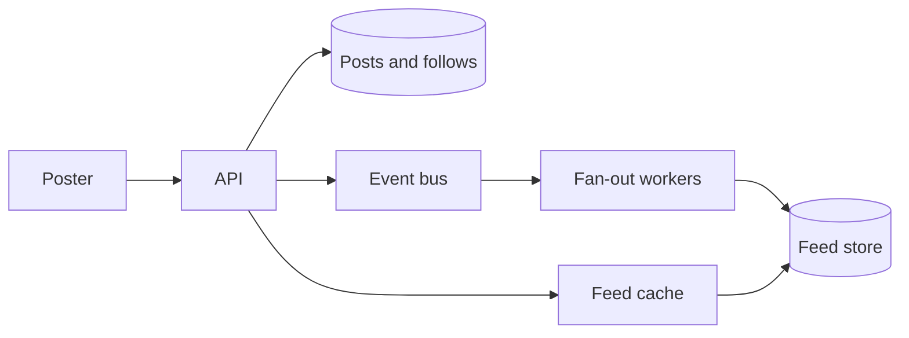

# Design: activity feed

**Level:** Must-have

**You practice:** fan-out, a hot celebrity user, and eventual consistency on a screen that can tolerate it.

## The problem

A user posts a short update. Followers see it in a reverse-chronological home feed. The poster sees their own post immediately.

## Numbers to say out loud

- 50 million registered users, 5 million daily active.
- A daily active user opens the feed 10 times a day and follows 200 accounts.
- Average feed reads: (5e6 × 10) / 86400 ≈ **600 reads per second**. Peak at 10× ≈ **6,000 per second**.
- Posts: assume each daily active user posts 0.2 times a day. (5e6 × 0.2) / 86400 ≈ **12 posts per second** average. Peak ≈ **120 per second**.
- One celebrity account has 10 million followers. A post from them is a different problem from a post from everyone else.
- The home feed shows the latest 500 items per user. Older history is a profile view, not the home fan-out.

Reads are the volume. The celebrity write is the spike.

## What you ask before drawing

- How fresh must a friend's post be? Assume a few seconds.
- Are there celebrity accounts? Assume yes.
- Do we rank the feed, or is it strictly time-ordered? Assume time-ordered. Ranking is a later product.
- Can a user have a million followers? Assume yes for a handful of accounts.

## A design that holds

**Post.** The API writes the post to the posts store (the source of truth) and returns it. The author's own next read comes from this write, so they have read-your-writes. An outbox publishes `PostCreated`.

**Ordinary fan-out on write.** A worker reads follower ids for the author. If the count is under a threshold (for example 10,000), it appends the post id to each follower's feed. The feed store is a table or a log per user: `user_id`, `post_id`, `created_at`. Batch the inserts.

**Celebrity fan-out on read.** If the author has more followers than the threshold, do not write 10 million feed rows. Mark the account as a celebrity. When a user opens the home feed, merge two lists: their precomputed feed, and recent posts from celebrity accounts they follow (a small set, cached). The merge is by time, and you take the top 500.

**Read.** Cache the first page of a user's merged feed for a short TTL (30 to 60 seconds) or invalidate it when you append to their feed. At 6,000 reads per second the cache matters for users who refresh.

**Follow and unfollow.** A new follow does not copy the celebrity's history into the feed. It copies the last few dozen ordinary posts, or it shows them on read. An unfollow removes that author's ids from the precomputed feed. Both can be async. The user can tolerate a short delay.

**Scale.** The API scales on X. Feeds are partitioned by `user_id` (Z). Posts are partitioned by `author_id` or just kept in one store at 120 writes per second, which is comfortable. The celebrity merge is a read-time join of a short list.

## The option to reject

**Fan-out on write for everyone, including the celebrity.** One post becomes 10 million synchronous writes. The post button blocks, or a queue grows for hours and then writes a stale story into every feed. The hybrid exists to avoid that.

**Fan-out on read for everyone.** Opening a feed would read the latest posts of 200 accounts on every refresh, at 6,000 refreshes per second. That is a lot of scatter reads, and it gets worse as follow counts grow. Precompute for ordinary users.

## What breaks

- The celebrity threshold is wrong and a mid-size account with 50,000 followers creates a large write. Tune the threshold, or make it two-tier. The design does not depend on the exact number. It depends on having a number.
- A user follows 50 celebrities. The merge reads 50 short lists. Cache each celebrity's recent posts so you do not hit the posts store per celebrity per home read.
- Clock skew makes two posts look tied. Break ties by post id.
- A deleted post is still in feeds. Either store a tombstone and filter, or remove the id asynchronously and accept a short window where a tap returns 404.

## Review

1. Why does the author see their post immediately when followers may not?
2. What is the write amplification of a celebrity post if you fan out to every follower?
3. What do you partition the feed store by, and why?
4. What happens on unfollow?

## Follow-ups an interviewer adds

- How do you rank instead of sorting by time? Keep the candidate set (the merged ids) and score it in a later stage. Do not rebuild fan-out for ranking.
- How do you backfill a new celebrity? Stop fan-out, keep their posts in the celebrity list, and let old feed rows age out.
- What about a user with 5,000 follows? The read-time celebrity list must stay small. Ordinary accounts stay on the write path. If "ordinary" is no longer ordinary, lower the threshold.

## Exercise

Compute the rows written for one celebrity post under pure fan-out, at 10 million followers. Then write the merge steps for a home read in five numbered lines.
