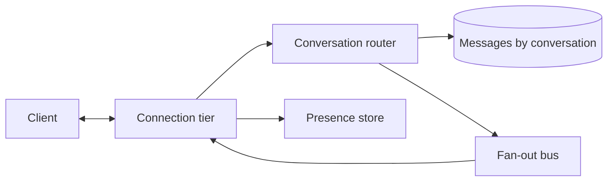

# Design: chat

**Level:** Must-have

**You practice:** long-lived connections, per-conversation ordering, and presence as ephemeral state.

## The problem

Two or more people exchange messages in a conversation. A user sees new messages without refreshing. They can tell who is currently connected. History is available when they open a conversation.

## Numbers to say out loud

- 1 million concurrent connections at peak.
- Each connection sends a message every 60 seconds on average (many are quieter). Send rate ≈ 1e6 / 60 ≈ **17,000 messages per second**.
- A message is about 1 KB stored. If the peak rate held all day, that would be 17,000 × 86,400 × 1 KB ≈ **1.5 TB/day**. It will not. Use the peak for the connection tier. For storage, assume the average rate is about a tenth of that peak: **0.15 TB/day**, or about **55 TB/year** before replication. With a two-year retention that is on the order of 100 TB plus replicas. You plan retention, and you partition by conversation.
- Delivery target: a message shows up for an online recipient in under a second, p99.
- You do not promise a total order across the whole product. You promise order **inside one conversation**.

## What you ask before drawing

- One-to-one only, or groups? Assume groups up to a few hundred. Larger groups start to look like the fan-out feed.
- Do we need read receipts? Assume yes, and keep them off the critical path.
- How long is history kept? Assume two years.
- Is presence exact? Assume "connected in the last 30 seconds," not a legal attendance record.

## A design that holds

**Connections.** Clients open a long-lived channel (WebSocket, or a platform equivalent). The connection tier is a set of stateless-looking processes that are in fact stateful: each holds sockets. A load balancer distributes new connections. Any instance can receive a message for a user, so instances subscribe to a bus (one subject per online user, or per conversation). Sticky sessions are an optimization, not the correctness story. If a process dies, the client reconnects and catches up by sequence number.

**Send.** The client sends `{conversation_id, client_msg_id, body}` to whichever instance it is connected to. That instance hands the write to the conversation owner, or writes directly to the message store. The store is partitioned by **`conversation_id`**, because every read is "the next page of this conversation." A partition by user id would scatter one conversation across the world.

**Order.** Each conversation has a monotonic **sequence**. The writer for that conversation assigns it (a row lock on a counter, or a single partition leader). Clients render in sequence order, not in arrival order. A gap means "ask for the missing range."

**Idempotency.** `client_msg_id` is unique per sender. A retry after a timeout inserts once. The second attempt returns the original sequence.

**History.** `GET /conversations/{id}/messages?before_sequence=`. The database serves this. The connection tier does not.

**Presence.** Each connection refreshes a key `presence:{user}` with a 30-second TTL. This key lives in a cache, not in the message database. It can be wrong for a few seconds. That is fine.

**Read receipts.** The client periodically sends the highest sequence it has displayed. Store it as a separate small write. Do not block message delivery on receipts.

**Groups.** Delivery copies the message to each member's live connection through the bus. A few hundred members is fine. If groups reach tens of thousands, stop pushing to everyone and switch those conversations toward the feed design (pull, or fan-out with a threshold).

## The option to reject

**One database row per user, updated in place, for "current presence and last message."** Presence churn at a million connections will melt that row pattern, and history does not fit in a cell.

**Ordering by wall-clock time on the sending device.** Clocks are wrong. Two messages will tie or invert. The conversation sequence is the order.

## What breaks

- A connection process dies. Clients reconnect, send the last sequence they saw, and receive the gap. Messages were in the database, not only in the socket.
- Two members send at once. The partition assigns two sequences. Both messages exist. The UI orders them.
- A hot conversation (a group that never stops talking) is a hot partition. Isolate very large groups onto their own scheme if one conversation dominates a shard.
- The bus is at-least-once. The client dedupes by sequence. A duplicate push must not show two bubbles.

## Review

1. Why is the partition key the conversation id?
2. What do you use instead of device clocks for order?
3. Where does presence live, and why is a TTL acceptable?
4. What does the client do after reconnect?

## Follow-ups an interviewer adds

- How do you type indicators? Same path as presence: ephemeral, not stored in the message log.
- How do you search history? A search index fed from the message log, lagging by seconds. The conversation view itself reads the database.
- How do you block a user? The connection tier checks a block list, cached, on send and on push.

## Exercise

Write the catch-up call a client makes after reconnect, and the rule that makes a retried send store one row. Include `client_msg_id` and `sequence` in the answer.
