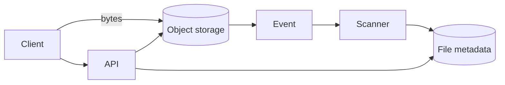

# Design: file upload

**Level:** Must-have

**You practice:** keeping large bytes off the API server, object storage, and an async scan.

## The problem

A user uploads a file up to 2 GB. You store it, scan it, and then let the owner download it. Other users can download it only after the scan says it is clean, and only if they are allowed.

## Numbers to say out loud

- 20,000 uploads a day, average size 50 MB, some at the 2 GB cap.
- Ingress per day ≈ 20,000 × 50 MB = **1 TB/day** into storage, plus replication if you replicate.
- Peak: a launch hour with 10× the average rate. The bytes still should not pass through your API process.
- The API request that *starts* an upload should return in well under a second. The upload itself takes as long as the user's network needs.
- A virus scan of a large file takes seconds to minutes. The user will not hold an HTTP request open for that.

## What you ask before drawing

- Maximum size? Assume 2 GB.
- Who can download? Assume the owner, and people they share with.
- Do we scan? Assume yes.
- Do we need resumable uploads? Assume yes for large files, because mobile networks drop.

## A design that holds

**Start.** The client calls `POST /files` with the name, size, and content type. The API checks the quota and the size cap, inserts a metadata row with status `pending`, and asks object storage for a **pre-signed upload URL** (or several URLs for parts). The URL is valid for minutes, not days, and it grants upload to one key only. The API returns the URL, the file id, and the status URL.

**Bytes.** The client uploads **directly to object storage**. The API servers do not hold the 2 GB. They do not write it to local disk. A rolling deploy in the middle of an upload does not lose a file that was going to the API's disk, because the API never had it.

**Complete.** Storage emits an event (`ObjectCreated`), or the client calls `POST /files/{id}/complete`. The API checks that the object exists and that the size matches, and sets status `scanning`.

**Scan.** A worker downloads or streams the object from storage, scans it, and sets `ready` or `rejected`. Rejected objects are deleted or quarantined. The worker is idempotent on file id: a second event does not start two user-visible outcomes.

**Download.** The client asks the API. The API checks authentication and authorization (this user may read this file). If the status is not `ready`, it returns 409 with the status. If it is `ready`, the API returns a short-lived pre-signed **download** URL. The bytes again go direct from storage to the client.

**Status for the UI.** The client polls `GET /files/{id}` or subscribes. The page says "scanning" instead of pretending the file is done at the first 200.

**Metadata** lives in your database: id, owner, object key, size, status, created time. The object key is not a guessable path that lists another user's files. Use an unguessable key, and still check authorization in the API. A pre-signed URL is a capability. Keep its lifetime short.

**Resumable uploads.** Use the storage provider's multipart upload. The client retries a failed part. Parts are not a second copy in your API.

## The option to reject

**Accept the file as a multipart body on the API, buffer it on local disk, then copy it to storage.** The API needs huge timeouts, huge disks, and a story for a process dying at 1.8 GB. You also scale API instances with byte volume, which is the wrong axis. Direct-to-storage removes that.

**Scan synchronously inside the complete request.** A 2 GB scan will time out. The status field exists so the scan can be slow.

## What breaks

- The client finishes the upload and never calls complete. A sweeper marks abandoned pending uploads and aborts the multipart upload so you do not pay for orphan parts forever.
- The scanner is down. Status stays `scanning`. The user can see that. Alert on age in `scanning`. Do not mark `ready` because the scanner was silent.
- A pre-signed URL leaks in a log or a chat paste. Short expiry limits the window. Authorization on the API metadata still matters for the next URL you mint.
- Content type is a lie (`image/png` that is not a PNG). Do not trust the client's type for security decisions. The scanner and a server-side sniff decide.

## Review

1. Why do the bytes skip the API?
2. What do you return while the scan is still running?
3. Why is a long-lived public object URL a bad download design?
4. How is the scan worker idempotent?

## Follow-ups an interviewer adds

- How do you upload from a server you trust, not a browser? The server can use the same pre-signed URL, or it can use a storage SDK with its own credentials. It still should not stream 2 GB through an unrelated API tier.
- How do you thumbnail a video? Another consumer of `ObjectCreated`, writing a derived object, with its own status. The original can be `ready` before the thumbnail exists if the product allows it.
- How do you encrypt? Storage-side encryption with a key the provider manages is the default. Customer-managed keys are a stricter option. Say which you need. Do not build a cipher.

## Exercise

Write the status values and the only transitions allowed between them (`pending`, `scanning`, `ready`, `rejected`). Say which transition the scanner is allowed to make, and which one it must not make twice.
