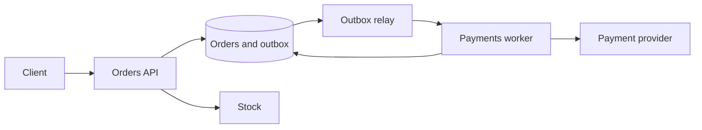

# Design: order checkout

**Level:** Must-have

**You practice:** a saga, the outbox, idempotency, and a single charge the user can see.

## The problem

A customer places an order. You reserve stock, charge a payment provider, and confirm the order. The customer is charged once. A crash at any step has a defined recovery. Inventory is not held forever when a payment is abandoned.

## Numbers to say out loud

- 200,000 orders a day.
- Average write rate: 200,000 / 86400 ≈ **2.3 orders per second**.
- Peak at 20× during a sale ≈ **50 orders per second**. This is not a sharding problem. It is a correctness problem. Say that out loud so you do not spend the interview drawing twenty services.
- One order payload stored ≈ 2 KB. A year of orders ≈ 200,000 × 365 × 2 KB ≈ **150 GB**, before indexes and events. One primary database is enough for the order rows.
- The payment provider's latency is 300 ms typical, sometimes 3 seconds, sometimes a timeout with an unknown outcome.
- The user waits on "placed," not on the warehouse pick.

If the interviewer multiplies the volume by 1,000, keep the correctness design and then partition orders by id. Do not change the saga because the number changed.

## What you ask before drawing

- Is stock limited? Assume yes.
- Can we charge before we know stock? Assume we reserve first, then charge, so we do not refund as the common path.
- Do we own the payment provider? Assume no. We cannot run a distributed transaction with them.
- What does the user see while payment is in flight? Assume "processing."

## A design that holds

**Place order, in one local transaction.**

1. Validate the cart.
2. Reserve stock for a short hold (for example 15 minutes) in the stock store. If stock is a different service, this is a call with an idempotency key `reserve:{order_id}`. If it fails, stop. Nothing has been charged.
3. Insert the order with status `pending_payment`, and insert an outbox row `TakePayment` with the same order id, in **one database transaction**.

The API returns **202** with the order id and a status URL. The user sees "processing."

**Take payment.** The relay publishes `TakePayment`. A worker calls the payment provider with an **idempotency key** equal to the order id (or `pay:{order_id}`). A timeout is not proof of failure. The worker retries with the **same** key. The provider charges once.

The worker writes the result through an inbox. The message id, or the order id, is unique in that table.

- **Paid.** Set the order to `paid` in the same transaction as the inbox row. Publish `OrderPaid` via the outbox so the warehouse can pick it.
- **Declined.** Set `payment_failed` and publish `ReleaseStock`.
- **Unknown after retries.** Leave `pending_payment` and alert. A human or a reconciler asks the provider for the status of that idempotency key. Do not charge "again" with a new key.

**Confirm stock.** On `OrderPaid`, the reservation becomes a real decrement. On release, the reservation returns to available stock. Both consumers are idempotent.

**Expiry.** A sweeper finds `pending_payment` older than the hold, asks the provider if the key was paid, and either completes the order or releases stock. The sweeper and the worker can race. The status change is a conditional update (`WHERE status = 'pending_payment'`), so only one of them wins.

**Read-your-writes.** The status URL reads the primary, or the write returns the current status. The user who just paid must not see a stale replica that still says "processing" forever. A few seconds of "processing" is the product. A permanent lie is a bug.

## The option to reject

**Two-phase commit across your database and the payment provider.** The provider does not sit in your transaction. A lock held open for their latency will stall checkout. A saga with an idempotency key is the design they actually support.

**Charge first, with no idempotency key, and hope the client does not retry.** Timeouts cause retries. Retries cause second charges. This is the failure the whole design exists to prevent.

**One synchronous call chain in the user request: reserve, charge, email, warehouse, all before the HTTP response.** The user's timeout becomes your partial failure. Accept the order, do the slow work after, and show status.

## What breaks

- Reserve succeeds, the process dies before the order commit. The reservation must expire on its own, or the reserve call is itself pending until the order commit via an outbox in the stock service. The simple version: reservations have a TTL, and the sweeper is the backstop.
- Payment succeeds, the worker dies before writing `paid`. The retry uses the same idempotency key, the provider says "already paid" and returns the original result, and the worker writes `paid`. The inbox stops a double state transition.
- A double `ReleaseStock` message. Releasing twice must not add extra stock. Release is "set this reservation to released," not "increment by quantity" with no reservation id.
- The provider is down. Orders stay `pending_payment`. You do not mark them failed just because of a timeout. You reconcile.

## Review

1. What is stored in the same transaction as the order row, and why?
2. Why is a timeout from the payment provider not the same as a decline?
3. What key makes the charge happen once?
4. How does the sweeper avoid fighting the worker?

## Follow-ups an interviewer adds

- How do you refund? A new saga step `Refund`, with its own idempotency key `refund:{order_id}:{attempt}`. Same inbox rule.
- How do you send the receipt email once? A consumer of `OrderPaid` with an inbox, or a column `receipt_sent_at` set in the same transaction as the send decision.
- What if stock and orders are in one database today? Keep one transaction for reserve plus order, and still use an outbox for the payment call. Do not introduce a second service to look distributed.

## Exercise

List every status the order can be in, and the only legal transitions. Mark the transitions that an at-least-once message might attempt twice, and the database predicate that makes the second attempt a no-op.
