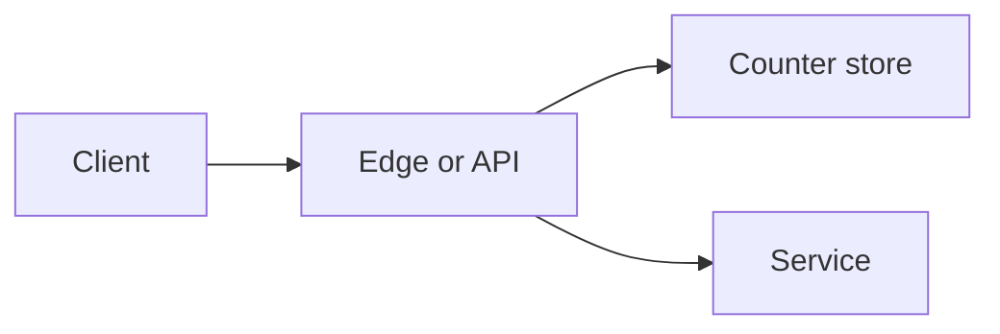

# Design: rate limiter

**Level:** Must-have

**You practice:** where shared state lives, 429 responses, and the difference between an exact limit and an approximate one.

## The problem

Protect an API from one caller taking the whole service. Enforce a limit such as 100 requests per minute per user, and a coarser limit per IP for unauthenticated traffic. Return a clear error when the caller is over the limit.

## Numbers to say out loud

- The edge sees **100,000 requests per second** at peak.
- Limits are per user (authenticated) and per IP (anonymous).
- A single user's limit is small (100 per minute). The *checker* must keep up with 100,000 decisions per second.
- A wrong answer of a few percent is acceptable for an abuse limit. It is not acceptable for a billing meter. Say which one you are building. This page is an abuse limit.
- Decision latency target: under a millisecond on the hot path, so the limiter is not the outage.

## What you ask before drawing

- Per user, per IP, per API key, or per route? Assume per user and per IP, with a stricter number on write routes.
- Do you need a global exact count, or is "about 100" enough? Assume about 100 is enough.
- Should a datacenter failure open the door (fail open) or shut it (fail closed)? For an abuse limit, failing open during a limiter outage is often right, together with a coarser local cap so one process cannot be crushed. Say the choice.

## A design that holds

**Token bucket**, one bucket per key. The bucket holds tokens, refilled at a steady rate, up to a burst size. A request takes one token. An empty bucket rejects the request. This allows a small burst and then a steady rate. A **leaky bucket** smooths into a steady outflow. For an API limit, a token bucket is the one to explain first.

**Where the counter lives.**

- **Central store** (Redis or a similar in-memory store with a small TTL). Every edge asks it. The count is shared, so 20 API instances cannot each allow 100 requests. Use one round trip, or a script that increments and sets expiry atomically so two requests cannot both reset the window.
- **Local approximate limit.** Each instance allows `limit / instance_count`, with some slack. No network call. The real global rate can overshoot when traffic is uneven. This is a fine first shield at the very edge, in front of a central check for the routes you care about.

At 100,000 decisions per second, a central store works if the increment is a single cheap command and the store is replicated for reads carefully. The key is the hot resource. Shard keys by hashing the user id (consistent hashing is natural here). A single key for "the whole internet" would be a hot key. You do not have one. You have many user keys.

**Response.** **429 Too Many Requests**, with `Retry-After` when you know the next token time. A [Problem Details](https://www.rfc-editor.org/rfc/rfc9457.html) body can repeat the limit and the remaining count. Document the headers. Some APIs also send `RateLimit-Limit` and `RateLimit-Remaining`. If you copy that style, say so. It is a common convention, not something you need a bespoke design for.

**Identity.** Use the authenticated user id when you have one. Fall back to IP for anonymous calls. Remember that many users can share an IP (a carrier, a university). Do not set the IP limit so low that a campus looks like an attacker. Prefer the user id whenever the caller is logged in.

**Write routes.** A tighter bucket on `POST /orders` than on `GET /catalog`. The expensive paths are the ones you protect first.

## The option to reject

**A counter in each application process, with no shared store, and "100 per minute" as the product promise.** Twenty instances allow about 2,000 per minute for one user. The published limit is a fiction. Either share the counter or publish a per-instance limit, which users cannot reason about. Share the counter.

**A strongly consistent database row per request, updated in a transaction.** 100,000 transactions per second of limiter updates will cost more than the API you are protecting. The limiter has to be cheaper than the work.

## What breaks

- The central store is down. You chose fail open with a local cap. Traffic rises, the local cap still protects a single process, and an alert fires because the store is unreachable.
- Clocks differ across instances and a fixed window (reset at the top of the minute) lets a caller send 100 just before the minute and 100 just after. A **sliding window** or a token bucket avoids that cliff. Mention the cliff if you draw a fixed window.
- A stolen token lets an attacker spend the user's budget. That is an auth problem. The limiter still reduces the damage.

## Review

1. Why is a per-process counter not a global limit?
2. What does a token bucket allow that a hard "no more than one every 600 ms" rule feels worse at?
3. When is failing open the right limiter outage mode?
4. Why do you avoid one database transaction per request for this?

## Follow-ups an interviewer adds

- How do you limit a distributed denial of service that comes from many IPs? The per-user and per-IP limits are not the whole defense. You also need volume at the edge, upstream of your app, from the network provider. Say that the application limiter is not a DDoS product.
- How do you let a partner have a higher limit? A different bucket size on their API key. The key is configuration, not a code change.
- How do you test it? A test with two processes and one shared counter, or a fake clock that refills the bucket.

## Exercise

Explain a token bucket of size 10, refilled at 1 token per second, to a burst of 15 immediate requests and then one request per second. How many of the first 15 succeed? When does the caller succeed again?
