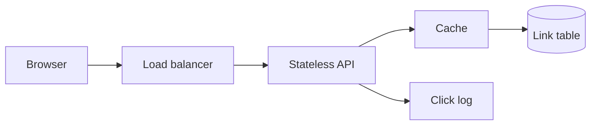

# Design: URL shortener

**Level:** Must-have

**You practice:** capacity numbers, cache-aside, id generation, and a read-heavy path.

## The problem

People submit a long URL and receive a short code. Opening the short link redirects to the long URL. Owners can see a click count. Links can be disabled.

## Numbers to say out loud

State these as assumptions. Change them if the interviewer changes the product.

- 100 million new links per month.
- Average write rate: 100e6 / (30 × 24 × 3600) ≈ **40 writes per second**.
- Peak writes at 10× ≈ **400 per second**.
- Reads outnumber writes 100 to 1, so peak reads ≈ **40,000 per second**.
- Keep links for 5 years: 100e6 × 12 × 5 = **6 billion rows**.
- About 500 bytes per row including indexes ≈ **3 TB**. That fits a partitioned database. It does not require anything exotic.
- Redirect latency target: p99 under 50 ms, not counting the destination site.

The read path is the design. The write path is quiet.

## What you ask before drawing

- Do links expire, or do owners delete them?
- Do we need custom codes (`/sale`) as well as generated ones?
- Is one click count exact, or is "close" enough?
- Is the shortener public, or inside one company?

Assume generated codes, optional expiry, and a click count that can lag by a minute.

## A design that holds

**Create.** The API validates the URL (scheme, length, a blocklist for your own domain so a link cannot point at another short link and loop). It generates a code and inserts one row: code, destination, owner, created time, expiry, enabled. The response is the short URL.

**Redirect.** The API looks up the code in the cache. On a miss it reads the database and fills the cache with a TTL of a day. If the row is missing, disabled, or expired, it returns 404. Otherwise it returns **302 Found** with a `Location` header.

Use **302**, not 301. A 301 is cached hard by browsers, so a later change of destination, or a disable, would not be seen by clients that cached the redirect. You also could not count those clicks.

**Ids.** Generate a random 64-bit value and encode it in base62. Check the rare collision with a unique constraint and try again. At 6 billion rows, a 64-bit space is still sparse (the space is about three billion times larger). Do not use a single auto-increment counter as the only generator if you want writes in more than one region later. A counter needs coordination. Random ids do not.

**UUID version 7** is a reasonable alternative when you want time-ordered primary keys for the table. The public code can still be a separate random token so people cannot guess the next link by adding one.

**Clicks.** Write a small event (code, time) to a log or a queue. A worker folds it into a counter. The redirect path does not update the counter in the same transaction as the read. Exact, synchronous counts would turn a cheap read into a write on the hot row.

**Scale.** The API scales on the X axis (more copies) behind the load balancer. The cache absorbs the popular codes. The database is a primary plus replicas. Partition by code only if the estimate grows well past a few terabytes or the write rate climbs. At these numbers, partitioning is optional. Say that.

**Cache key.** The short code. **TTL.** One day, with jitter so popular keys do not expire together. **Invalidation.** Delete the key when the owner changes the destination or disables the link.

## The option to reject

**Hash the destination URL and use the hash as the code.** Two people shortening the same URL would collide or share a code, so you could not disable one of them. You also cannot rotate a code without changing the URL. Random ids plus a unique constraint are dull and they work.

**Serve redirects from the database with no cache.** 40,000 reads per second of the same celebrity link is a self-inflicted hot row. The cache exists for that row.

## What breaks

- A cache stampede on a key that just expired. One request refills. The others wait briefly or serve the stale value.
- Cache filled, then the owner disables the link. You delete the key in that write. A replica lag on the database is covered by the delete.
- Someone stores `https://yourshortener/abc`, which points at another short link. Reject destinations on your own host.
- The click worker falls behind. Counts lag. Redirects still work. That is the tradeoff you named.

## Review

1. Why is the response a 302?
2. Why is a random code safer than a hash of the URL?
3. Why is the click count not updated on the redirect transaction?
4. At these numbers, do you shard on day one? What number would change your mind?

## Follow-ups an interviewer adds

- How do you stop someone from creating a million links a minute? Put the [rate limiter](rate-limiter.md) in front of create.
- How do you delete 6 billion rows of expired links? A scheduled job by expiry date, and an index on expiry. Do not scan the table.
- What if the destination is a malware site? A blocklist check on create, and a way to disable a code quickly (cache delete plus a flag).

## Exercise

Write the redirect handler in pseudocode, including cache miss, expiry, and the 302. Then write the create path's unique-constraint retry. Ten lines each is enough.
